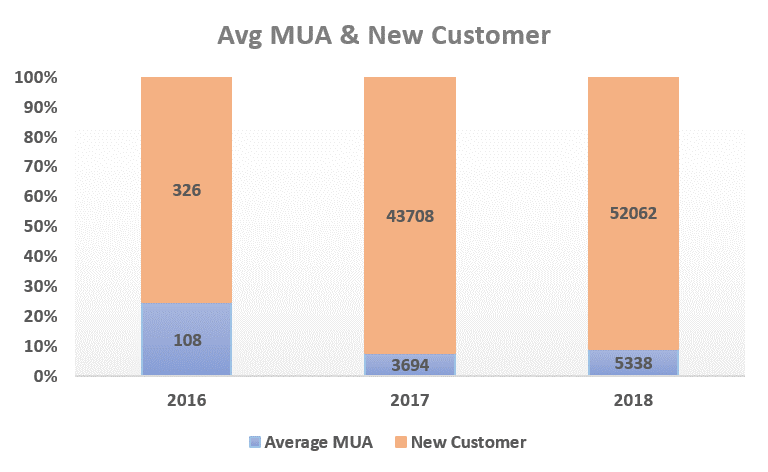
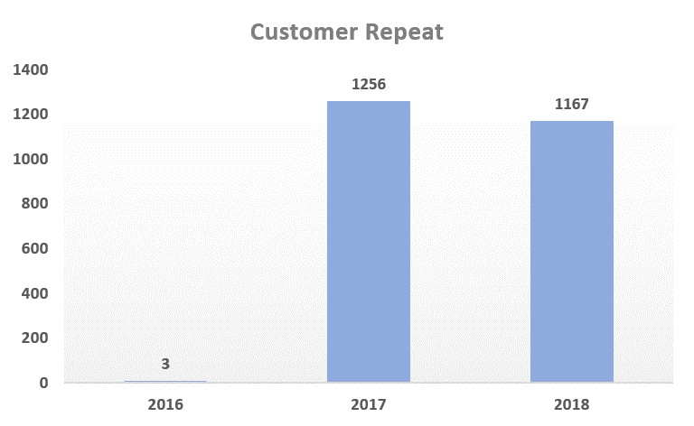
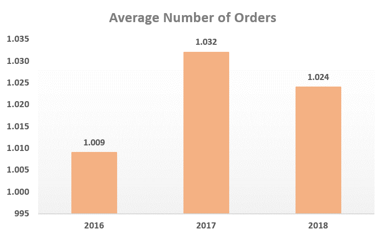
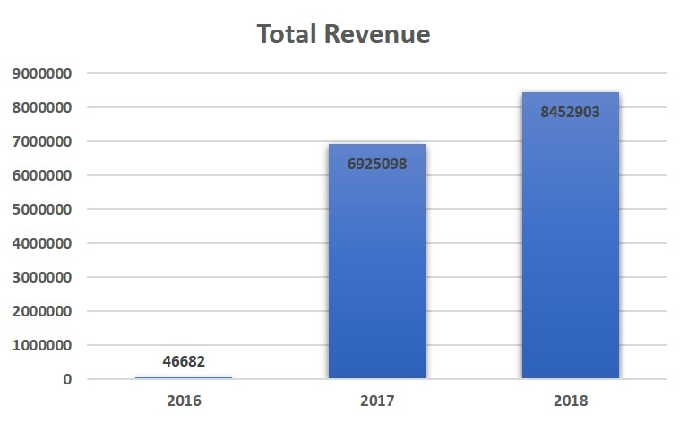
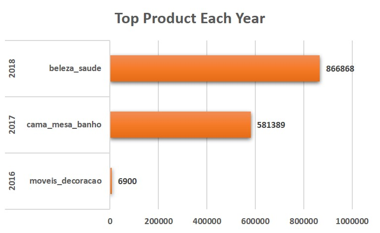
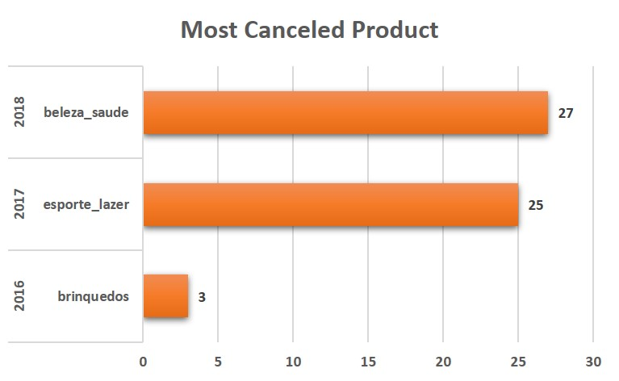
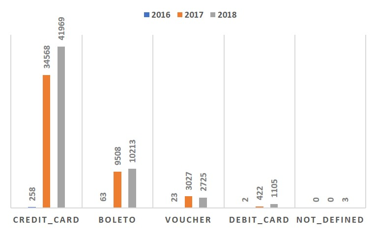

# 💰 **Comprehensive Business Intelligence Analysis of Brazilian E-Commerce Using SQL**


---

## Table of Contents

1. [Project Overview](https://github.com/hifizhhh/Comprehensive-Business-Intelligence-Analysis-of-Brazilian-E-Commerce-Using-SQL?tab=readme-ov-file#-project-overview)
2. [Data Preparation](https://github.com/hifizhhh/Comprehensive-Business-Intelligence-Analysis-of-Brazilian-E-Commerce-Using-SQL?tab=readme-ov-file#-data-preparation)

   - [Database Construction & ERD](https://github.com/hifizhhh/Comprehensive-Business-Intelligence-Analysis-of-Brazilian-E-Commerce-Using-SQL?tab=readme-ov-file#database-construction--erd)

3. [Data Analysis](https://github.com/hifizhhh/Comprehensive-Business-Intelligence-Analysis-of-Brazilian-E-Commerce-Using-SQL?tab=readme-ov-file#-data-analysis)

   - [Customer Activity Growth](https://github.com/hifizhhh/Comprehensive-Business-Intelligence-Analysis-of-Brazilian-E-Commerce-Using-SQL?tab=readme-ov-file#customer-activity-growth)
   - [Product Category Performance](https://github.com/hifizhhh/Comprehensive-Business-Intelligence-Analysis-of-Brazilian-E-Commerce-Using-SQL?tab=readme-ov-file#product-category-performance)
   - [Payment Method Trends](https://github.com/hifizhhh/Comprehensive-Business-Intelligence-Analysis-of-Brazilian-E-Commerce-Using-SQL?tab=readme-ov-file#payment-method-trends)

4. [Business Insights Summary](https://github.com/hifizhhh/Comprehensive-Business-Intelligence-Analysis-of-Brazilian-E-Commerce-Using-SQL?tab=readme-ov-file#-business-insights-summary)
5. [Business Implications](https://github.com/hifizhhh/Comprehensive-Business-Intelligence-Analysis-of-Brazilian-E-Commerce-Using-SQL?tab=readme-ov-file#-business-implications)
6. [Tools & Environment](https://github.com/hifizhhh/Comprehensive-Business-Intelligence-Analysis-of-Brazilian-E-Commerce-Using-SQL?tab=readme-ov-file#-tools--environment)
7. [Reproducibility Guide](https://github.com/hifizhhh/Comprehensive-Business-Intelligence-Analysis-of-Brazilian-E-Commerce-Using-SQL?tab=readme-ov-file#-reproducibility-guide)

---

## 📂 **Project Overview**

### Background

Evaluating business performance is crucial for every organization, as it provides insights into the effectiveness of business strategies and operational processes. This analysis project focuses on assessing the performance of an e-commerce company based on key metrics including customer growth, product category performance, and payment trends using historical data spanning three years.

### Project Goals

This project aims to derive actionable insights through analytical and visual interpretations of the following:

1. **Customer Activity Growth per Year**
2. **Product Category Quality per Year**
3. **Payment Type Usage per Year**

---

## 📂 **Data Preparation**

The dataset originates from a Brazilian e-commerce platform, encompassing 99,441 orders between 2016 and 2018. It includes attributes such as order status, customer and seller location, item details, payment types, and customer reviews.

### Database Construction & ERD

The following steps were carried out:

1. Creating a new PostgreSQL workspace and defining table schemas using `CREATE TABLE`.
2. Importing CSV files into the respective tables.
3. Setting primary and foreign key constraints to establish table relationships.
4. Generating the Entity Relationship Diagram (ERD) using pgAdmin's ERD tool.

<details>
  <summary>Click to view SQL Queries</summary>

```sql
-- 1) Create the ecommerce database
CREATE DATABASE IF NOT EXISTS ecommerce;

-- Use the ecommerce database
USE ecommerce;

-- 2) Create table to store customer data
CREATE TABLE customers_dataset (
    customer_id VARCHAR(50), -- Customer ID
    customer_unique_id VARCHAR(50), -- Unique customer ID
    customer_zip_code_prefix VARCHAR(20), -- Customer's zip code prefix
    customer_city VARCHAR(50), -- Customer's city
    customer_state VARCHAR(10) -- Customer's state
);

-- 3) Create table to store geolocation data
CREATE TABLE geolocation_dataset (
    geolocation_zip_code_prefix VARCHAR(50), -- Zip code for geolocation
    geolocation_lat DECIMAL(9,6), -- Geolocation latitude
    geolocation_lng DECIMAL(9,6), -- Geolocation longitude
    geolocation_city VARCHAR(50), -- City of the geolocation
    geolocation_state VARCHAR(10) -- State of the geolocation
);

-- 4) Create table to store order item data
CREATE TABLE order_items_dataset (
    order_id VARCHAR(50), -- Order ID
    order_item_id INT, -- Order item ID
    product_id VARCHAR(50), -- Product ID
    seller_id VARCHAR(50), -- Seller ID
    shipping_limit_date TIMESTAMP, -- Shipping limit date
    price DECIMAL(10,2), -- Price of the product
    freight_value DECIMAL(10,2) -- Freight cost
);

-- 5) Create table to store order payment data
CREATE TABLE order_payments_dataset (
    order_id VARCHAR(50), -- Order ID
    payment_sequential INT, -- Payment sequential number
    payment_type VARCHAR(20), -- Type of payment
    payment_installments INT, -- Number of payment installments
    payment_value DECIMAL(10,2) -- Total payment value
);

-- 6) Create table to store order review data
CREATE TABLE order_reviews_dataset (
    review_id VARCHAR(100), -- Review ID
    order_id VARCHAR(50), -- Order ID
    review_score INT, -- Review score
    review_comment_title VARCHAR(50), -- Review comment title
    review_comment_message VARCHAR(1000), -- Review comment message
    review_creation_date TIMESTAMP, -- Review creation date
    review_answer_timestamp TIMESTAMP -- Review answer timestamp
);

-- 7) Create table to store order data
CREATE TABLE orders_dataset (
    order_id VARCHAR(50), -- Order ID
    customer_id VARCHAR(50), -- Customer ID
    order_status VARCHAR(20), -- Order status
    order_purchase_timestamp TIMESTAMP, -- Order purchase timestamp
    order_approved_at TIMESTAMP, -- Order approval timestamp
    order_delivered_carrier_date TIMESTAMP, -- Delivery date by carrier
    order_delivered_customer_date TIMESTAMP, -- Customer received date
    order_estimated_delivery_date TIMESTAMP -- Estimated delivery date
);

-- 8) Create table to store product data
CREATE TABLE products_dataset (
    product_id VARCHAR(50), -- Product ID
    product_category_name VARCHAR(50), -- Product category name
    product_name_length INT, -- Product name length
    product_description_length INT, -- Product description length
    product_photos_qty INT, -- Number of product photos
    product_weight_g DECIMAL(10,2), -- Product weight (grams)
    product_length_cm DECIMAL(10,2), -- Product length (cm)
    product_height_cm DECIMAL(10,2), -- Product height (cm)
    product_width_cm DECIMAL(10,2) -- Product width (cm)
);

-- 9) Create table to store seller data
CREATE TABLE sellers_dataset (
    seller_id VARCHAR(50), -- Seller ID
    seller_zip_code_prefix VARCHAR(20), -- Seller's zip code prefix
    seller_city VARCHAR(50), -- Seller's city
    seller_state VARCHAR(10) -- Seller's state
);

-- 10) Import customer data
LOAD DATA INFILE 'C:/ProgramData/MySQL/MySQL Server 8.0/Uploads/ecommerce/olist_customers_dataset.csv'
INTO TABLE customers_dataset
FIELDS TERMINATED BY ','
ENCLOSED BY '"'
LINES TERMINATED BY '\n'
IGNORE 1 ROWS
(
    customer_id,
    customer_unique_id,
    customer_zip_code_prefix,
    customer_city,
    customer_state
);

-- 11) Import geolocation data
LOAD DATA INFILE 'C:/ProgramData/MySQL/MySQL Server 8.0/Uploads/ecommerce/olist_geolocation_dataset.csv'
INTO TABLE geolocation_dataset
FIELDS TERMINATED BY ','
ENCLOSED BY '"'
LINES TERMINATED BY '\n'
IGNORE 1 ROWS
(
    @geolocation_zip_code_prefix,
    @geolocation_lat,
    @geolocation_lng,
    @geolocation_city,
    @geolocation_state
)
SET
    geolocation_zip_code_prefix = NULLIF(TRIM(@geolocation_zip_code_prefix), ''),
    geolocation_lat = NULLIF(TRIM(@geolocation_lat), ''),
    geolocation_lng = NULLIF(TRIM(@geolocation_lng), ''),
    geolocation_city = NULLIF(TRIM(@geolocation_city), ''),
    geolocation_state = NULLIF(TRIM(@geolocation_state), '');

-- 12) Import order items data
LOAD DATA INFILE 'C:/ProgramData/MySQL/MySQL Server 8.0/Uploads/ecommerce/olist_order_items_dataset.csv'
INTO TABLE order_items_dataset
FIELDS TERMINATED BY ','
ENCLOSED BY '"'
LINES TERMINATED BY '\n'
IGNORE 1 ROWS
(
    @order_id,
    @order_item_id,
    @product_id,
    @seller_id,
    @shipping_limit_date,
    @price,
    @freight_value
)
SET
    order_id = NULLIF(TRIM(@order_id), ''),
    order_item_id = NULLIF(TRIM(@order_item_id), ''),
    product_id = NULLIF(TRIM(@product_id), ''),
    seller_id = NULLIF(TRIM(@seller_id), ''),
    shipping_limit_date = NULLIF(TRIM(@shipping_limit_date), ''),
    price = NULLIF(TRIM(@price), ''),
    freight_value = NULLIF(TRIM(@freight_value), '');

-- 13) Import order payments data
LOAD DATA INFILE 'C:/ProgramData/MySQL/MySQL Server 8.0/Uploads/ecommerce/olist_order_payments_dataset.csv'
INTO TABLE order_payments_dataset
FIELDS TERMINATED BY ','
ENCLOSED BY '"'
LINES TERMINATED BY '\n'
IGNORE 1 ROWS
(
    @order_id,
    @payment_sequential,
    @payment_type,
    @payment_installments,
    @payment_value
)
SET
    order_id = NULLIF(TRIM(@order_id), ''),
    payment_sequential = NULLIF(TRIM(@payment_sequential), ''),
    payment_type = NULLIF(TRIM(@payment_type), ''),
    payment_installments = NULLIF(TRIM(@payment_installments), ''),
    payment_value = NULLIF(TRIM(@payment_value), '');

-- 14) Import order reviews data
LOAD DATA INFILE 'C:/ProgramData/MySQL/MySQL Server 8.0/Uploads/ecommerce/olist_order_reviews_dataset.csv'
INTO TABLE order_reviews_dataset
FIELDS TERMINATED BY ','
ENCLOSED BY '"'
LINES TERMINATED BY '\n'
IGNORE 1 ROWS
(
    @review_id,
    @order_id,
    @review_score,
    @review_comment_title,
    @review_comment_message,
    @review_creation_date,
    @review_answer_timestamp
)
SET
    review_id = NULLIF(TRIM(@review_id), ''),
    order_id = NULLIF(TRIM(@order_id), ''),
    review_score = NULLIF(TRIM(@review_score), ''),
    review_comment_title = NULLIF(TRIM(@review_comment_title), ''),
    review_comment_message = NULLIF(TRIM(@review_comment_message), ''),
    review_creation_date = NULLIF(TRIM(@review_creation_date), ''),
    review_answer_timestamp = NULLIF(TRIM(@review_answer_timestamp), '');

-- 15) Import orders data
LOAD DATA INFILE 'C:/ProgramData/MySQL/MySQL Server 8.0/Uploads/olist_orders_dataset.csv'
INTO TABLE orders_dataset
FIELDS TERMINATED BY ','
ENCLOSED BY '"'
LINES TERMINATED BY '\n'
IGNORE 1 ROWS
(
    order_id,
    customer_id,
    order_status,
    @order_purchase_timestamp,
    @order_approved_at,
    @order_delivered_carrier_date,
    @order_delivered_customer_date,
    @order_estimated_delivery_date
)
SET
    order_purchase_timestamp = NULLIF(TRIM(@order_purchase_timestamp), ''),
    order_approved_at = NULLIF(TRIM(@order_approved_at), ''),
    order_delivered_carrier_date = NULLIF(TRIM(@order_delivered_carrier_date), ''),
    order_delivered_customer_date = NULLIF(TRIM(@order_delivered_customer_date), ''),
    order_estimated_delivery_date = NULLIF(TRIM(@order_estimated_delivery_date), '');

-- 16) Import product data
LOAD DATA INFILE 'C:/ProgramData/MySQL/MySQL Server 8.0/Uploads/ecommerce/olist_products_dataset.csv'
INTO TABLE products_dataset
FIELDS TERMINATED BY ','
ENCLOSED BY '"'
LINES TERMINATED BY '\n'
IGNORE 1 ROWS
(
    @product_id,
    @product_category_name,
    @product_name_length,
    @product_description_length,
    @product_photos_qty,
    @product_weight_g,
    @product_length_cm,
    @product_height_cm,
    @product_width_cm
)
SET
    product_id = NULLIF(TRIM(@product_id), ''),
    product_category_name = NULLIF(TRIM(@product_category_name), ''),
    product_name_length = NULLIF(TRIM(@product_name_length), ''),
    product_description_length = NULLIF(TRIM(@product_description_length), ''),
    product_photos_qty = NULLIF(TRIM(@product_photos_qty), ''),
    product_weight_g = NULLIF(TRIM(@product_weight_g), ''),
    product_length_cm = NULLIF(TRIM(@product_length_cm), ''),
    product_height_cm = NULLIF(TRIM(@product_height_cm), ''),
    product_width_cm = NULLIF(TRIM(@product_width_cm), '');

-- 17) Import seller data
LOAD DATA INFILE 'C:/ProgramData/MySQL/MySQL Server 8.0/Uploads/ecommerce/olist_sellers_dataset.csv'
INTO TABLE sellers_dataset
FIELDS TERMINATED BY ','
ENCLOSED BY '"'
LINES TERMINATED BY '\n'
IGNORE 1 ROWS
(
    @seller_id,
    @seller_zip_code_prefix,
    @seller_city,
    @seller_state
)
SET
    seller_id = NULLIF(TRIM(@seller_id), ''),
    seller_zip_code_prefix = NULLIF(TRIM(@seller_zip_code_prefix), ''),
    seller_city = NULLIF(TRIM(@seller_city), ''),
    seller_state = NULLIF(TRIM(@seller_state), '');

-- 18) Add Primary Key to each table
ALTER TABLE customers_dataset ADD CONSTRAINT customers_dataset_pkey PRIMARY KEY (customer_id);
ALTER TABLE sellers_dataset ADD CONSTRAINT sellers_dataset_pkey PRIMARY KEY (seller_id);
ALTER TABLE products_dataset ADD CONSTRAINT products_dataset_pkey PRIMARY KEY (product_id);
ALTER TABLE orders_dataset ADD CONSTRAINT orders_dataset_pkey PRIMARY KEY (order_id);
ALTER TABLE geolocation_dataset ADD CONSTRAINT geolocation_dataset_pkey PRIMARY KEY (geolocation_zip_code_prefix);

-- 19) Add Foreign Keys for relationships between tables
ALTER TABLE orders_dataset
ADD CONSTRAINT fk_orders_customers
FOREIGN KEY (customer_id) REFERENCES customers_dataset (customer_id);

ALTER TABLE order_payments_dataset
ADD CONSTRAINT fk_payments_order
FOREIGN KEY (order_id) REFERENCES orders_dataset (order_id);

ALTER TABLE order_reviews_dataset
ADD CONSTRAINT fk_reviews_order
FOREIGN KEY (order_id) REFERENCES orders_dataset (order_id);

ALTER TABLE order_items_dataset
ADD CONSTRAINT fk_items_order
FOREIGN KEY (order_id) REFERENCES orders_dataset (order_id);

ALTER TABLE order_items_dataset
ADD CONSTRAINT fk_items_product
FOREIGN KEY (product_id) REFERENCES products_dataset (product_id);

ALTER TABLE order_items_dataset
ADD CONSTRAINT items_sellers
FOREIGN KEY (seller_id) REFERENCES sellers_dataset (seller_id);

ALTER TABLE customers_dataset
ADD CONSTRAINT customers_geolocation
FOREIGN KEY (customer_zip_code_prefix) REFERENCES geolocation_dataset (geolocation_zip_code_prefix);
```

</details>


---

## 📂 **Data Analysis**

### Customer Activity Growth

<details>
  <summary>Click to view SQL Queries</summary>

```sql
-- 1) Display the average number of monthly active users for each year
SELECT
    year,
    FLOOR(AVG(customer_total)) AS avg_mau -- Calculate the average number of monthly active users
FROM (
    SELECT
        YEAR(od.order_purchase_timestamp) AS year, -- Determine the transaction year
        MONTH(od.order_purchase_timestamp) AS month, -- Determine the transaction month
        COUNT(DISTINCT cd.customer_unique_id) AS customer_total -- Count the unique customers per month
    FROM orders_dataset AS od
    JOIN customers_dataset AS cd
        ON cd.customer_id = od.customer_id -- Join the orders data with the customer data
    GROUP BY year, month -- Group by year and month
) AS sub
GROUP BY year -- Group the final results by year
ORDER BY year; -- Order by year

-- 2) Display the number of new customers for each year
SELECT
    year,
    COUNT(customer_unique_id) AS total_new_customer -- Count the number of new customers
FROM (
    SELECT
        MIN(YEAR(od.order_purchase_timestamp)) AS year, -- Determine the first year a customer made a purchase
        cd.customer_unique_id -- Unique customer ID
    FROM orders_dataset AS od
    JOIN customers_dataset AS cd
        ON cd.customer_id = od.customer_id -- Join the orders data with the customer data
    GROUP BY cd.customer_unique_id -- Group by customer ID
) AS sub
GROUP BY year -- Group the final results by year
ORDER BY year; -- Order by year

-- 3) Display the number of repeat order customers for each year
SELECT
    year,
    COUNT(customer_unique_id) AS total_customer_repeat -- Count the customers who made more than one purchase
FROM (
    SELECT
        YEAR(od.order_purchase_timestamp) AS year, -- Determine the transaction year
        cd.customer_unique_id, -- Unique customer ID
        COUNT(od.order_id) AS total_order -- Count the total orders made by each customer
    FROM orders_dataset AS od
    JOIN customers_dataset AS cd
        ON cd.customer_id = od.customer_id -- Join the orders data with the customer data
    GROUP BY year, cd.customer_unique_id -- Group by year and customer ID
    HAVING COUNT(od.order_id) > 1 -- Only include customers who made more than one purchase
) AS sub
GROUP BY year -- Group the final results by year
ORDER BY year; -- Order by year

-- 4) Display the average number of orders made by customers for each year
SELECT
    year,
    ROUND(AVG(freq), 3) AS avg_frequency -- Calculate the average number of orders per customer
FROM (
    SELECT
        YEAR(od.order_purchase_timestamp) AS year, -- Determine the transaction year
        cd.customer_unique_id, -- Unique customer ID
        COUNT(od.order_id) AS freq -- Count the number of orders per customer
    FROM orders_dataset AS od
    JOIN customers_dataset AS cd
        ON cd.customer_id = od.customer_id -- Join the orders data with the customer data
    GROUP BY year, cd.customer_unique_id -- Group by year and customer ID
) AS sub
GROUP BY year -- Group the final results by year
ORDER BY year; -- Order by year

-- 5) Combine all the metrics above into one table view
WITH cte_mau AS (
    SELECT
        year,
        FLOOR(AVG(customer_total)) AS avg_mau -- Calculate the average number of monthly active users
    FROM (
        SELECT
            YEAR(od.order_purchase_timestamp) AS year, -- Determine the transaction year
            MONTH(od.order_purchase_timestamp) AS month, -- Determine the transaction month
            COUNT(DISTINCT cd.customer_unique_id) AS customer_total -- Count the unique customers per month
        FROM orders_dataset AS od
        JOIN customers_dataset AS cd
            ON cd.customer_id = od.customer_id -- Join the orders data with the customer data
        GROUP BY year, month -- Group by year and month
    ) AS sub
    GROUP BY year -- Group the final results by year
),
cte_new_cust AS (
    SELECT
        year,
        COUNT(customer_unique_id) AS total_new_customer -- Count the number of new customers
    FROM (
        SELECT
            MIN(YEAR(od.order_purchase_timestamp)) AS year, -- Determine the first year a customer made a purchase
            cd.customer_unique_id -- Unique customer ID
        FROM orders_dataset AS od
        JOIN customers_dataset AS cd
            ON cd.customer_id = od.customer_id -- Join the orders data with the customer data
        GROUP BY cd.customer_unique_id -- Group by customer ID
    ) AS sub
    GROUP BY year -- Group the final results by year
),
cte_repeat_order AS (
    SELECT
        year,
        COUNT(customer_unique_id) AS total_customer_repeat -- Count the customers who made more than one purchase
    FROM (
        SELECT
            YEAR(od.order_purchase_timestamp) AS year, -- Determine the transaction year
            cd.customer_unique_id, -- Unique customer ID
            COUNT(od.order_id) AS total_order -- Count the total orders made by each customer
        FROM orders_dataset AS od
        JOIN customers_dataset AS cd
            ON cd.customer_id = od.customer_id -- Join the orders data with the customer data
        GROUP BY year, cd.customer_unique_id -- Group by year and customer ID
        HAVING COUNT(od.order_id) > 1 -- Only include customers who made more than one purchase
    ) AS sub
    GROUP BY year -- Group the final results by year
),
cte_frequency AS (
    SELECT
        year,
        ROUND(AVG(freq), 3) AS avg_frequency -- Calculate the average number of orders per customer
    FROM (
        SELECT
            YEAR(od.order_purchase_timestamp) AS year, -- Determine the transaction year
            cd.customer_unique_id, -- Unique customer ID
            COUNT(od.order_id) AS freq -- Count the number of orders per customer
        FROM orders_dataset AS od
        JOIN customers_dataset AS cd
            ON cd.customer_id = od.customer_id -- Join the orders data with the customer data
        GROUP BY year, cd.customer_unique_id -- Group by year and customer ID
    ) AS sub
    GROUP BY year -- Group the final results by year
)

-- Display the combined results from all the metrics
SELECT
    mau.year AS year, -- Display the year
    avg_mau, -- Average number of monthly active users
    total_new_customer, -- Total number of new customers
    total_customer_repeat, -- Total number of repeat order customers
    avg_frequency -- Average number of orders per customer
FROM
    cte_mau AS mau
JOIN cte_new_cust AS nc ON mau.year = nc.year -- Join MAU data with new customers by year
JOIN cte_repeat_order AS ro ON nc.year = ro.year -- Join with repeat order customers
JOIN cte_frequency AS f ON ro.year = f.year -- Join with the average frequency of orders
GROUP BY 1, 2, 3, 4, 5 -- Group the results by year and metrics
ORDER BY 1; -- Order by year
```

</details>

Key findings:

- Significant increase in MAU and new customers, especially between 2016 and 2017.
- Repeat orders peaked in 2017 and slightly declined in 2018.
- Most users only placed one order per year, indicating low customer retention.





---

### Product Category Performance

<details>
  <summary>Click to view SQL Queries</summary>

```sql
-- 1) Create a table containing the total revenue information for each year
CREATE TABLE total_revenue AS
SELECT
    YEAR(od.order_purchase_timestamp) AS year, -- Determine the year of transaction
    SUM(oid.price + oid.freight_value) AS revenue -- Calculate total revenue based on price and freight value
FROM order_items_dataset AS oid
JOIN orders_dataset AS od
    ON oid.order_id = od.order_id -- Join the order and item data
WHERE od.order_status = 'delivered' -- Only count orders that have been delivered
GROUP BY year
ORDER BY year; -- Sort by year

-- 2) Create a table containing the total canceled orders for each year
CREATE TABLE canceled_order AS
SELECT
    YEAR(order_purchase_timestamp) AS year, -- Determine the year of order cancellation
    COUNT(order_status) AS canceled -- Count the number of canceled orders
FROM orders_dataset
WHERE order_status = 'canceled' -- Filter for only canceled orders
GROUP BY year
ORDER BY year; -- Sort by year

-- 3) Create a table containing the product category with the highest revenue for each year
CREATE TABLE top_product_category AS
SELECT
    year,
    top_category,
    product_revenue
FROM (
    SELECT
        YEAR(od.order_purchase_timestamp) AS year, -- Determine the year of transaction
        pd.product_category_name AS top_category, -- Get the product category name
        SUM(oid.price + oid.freight_value) AS product_revenue, -- Calculate total revenue based on product and freight value
        RANK() OVER (
            PARTITION BY YEAR(od.order_purchase_timestamp)
            ORDER BY SUM(oid.price + oid.freight_value) DESC -- Rank categories based on highest revenue
        ) AS ranking
    FROM orders_dataset AS od
    JOIN order_items_dataset AS oid
        ON od.order_id = oid.order_id -- Join orders and items
    JOIN products_dataset AS pd
        ON oid.product_id = pd.product_id -- Join items with product data
    WHERE od.order_status = 'delivered' -- Filter for only delivered orders
    GROUP BY YEAR(od.order_purchase_timestamp), pd.product_category_name
) AS sub
WHERE ranking = 1 -- Select the top product category with the highest revenue
ORDER BY year; -- Sort by year

-- 4) Create a table containing the product category with the highest number of canceled orders for each year
CREATE TABLE most_canceled_category AS
SELECT
    year,
    most_canceled,
    total_canceled
FROM (
    SELECT
        YEAR(od.order_purchase_timestamp) AS year, -- Determine the year of transaction
        pd.product_category_name AS most_canceled, -- Get the product category with the highest cancellations
        COUNT(od.order_id) AS total_canceled, -- Count the total cancellations
        RANK() OVER (
            PARTITION BY YEAR(od.order_purchase_timestamp)
            ORDER BY COUNT(od.order_id) DESC -- Rank categories based on the number of cancellations
        ) AS ranking
    FROM orders_dataset AS od
    JOIN order_items_dataset AS oid
        ON od.order_id = oid.order_id -- Join orders and items
    JOIN products_dataset AS pd
        ON oid.product_id = pd.product_id -- Join items with product data
    WHERE od.order_status = 'canceled' -- Filter for only canceled orders
    GROUP BY YEAR(od.order_purchase_timestamp), pd.product_category_name
) AS sub
WHERE ranking = 1 -- Select the product category with the most cancellations
ORDER BY year; -- Sort by year

-- 5) Display the table combining total revenue, top product, canceled orders, and the most canceled product category
SELECT
    tr.year, -- Display the year
    tr.revenue AS total_revenue, -- Total revenue for the year
    tpc.top_category AS top_product, -- Name of the top product category
    tpc.product_revenue AS total_revenue_top_product, -- Revenue for the top product category
    co.canceled AS total_canceled, -- Total canceled orders for the year
    mcc.most_canceled AS top_canceled_product, -- Name of the product category with the most cancellations
    mcc.total_canceled AS total_top_canceled_product -- Total cancellations for the most canceled product category
FROM total_revenue AS tr
JOIN top_product_category AS tpc
    ON tr.year = tpc.year -- Join total revenue with top product category by year
JOIN canceled_order AS co
    ON tpc.year = co.year -- Join with canceled orders by year
JOIN most_canceled_category AS mcc
    ON co.year = mcc.year -- Join with the most canceled product category by year
ORDER BY tr.year; -- Sort by year
```

</details>

Highlights:

- Revenue increased consistently over the years.
- Leading product categories changed each year.
- `Health_beauty` was the top revenue and most canceled category in 2018, reflecting both popularity and volatility.





---

### Payment Method Trends

<details>
  <summary>Click to view SQL Queries</summary>

```sql
-- Display the number of users based on payment method
SELECT
    payment_type,
    COUNT(*) AS total_users -- Count the total number of users for each payment method
FROM order_payments_dataset
GROUP BY payment_type -- Group by payment method
ORDER BY total_users DESC; -- Order by the number of users in descending order

-- Display the total usage of payment methods per year
SELECT
    payment_type,
    SUM(CASE WHEN year = 2016 THEN total ELSE 0 END) AS "2016", -- Total payment usage in 2016
    SUM(CASE WHEN year = 2017 THEN total ELSE 0 END) AS "2017", -- Total payment usage in 2017
    SUM(CASE WHEN year = 2018 THEN total ELSE 0 END) AS "2018", -- Total payment usage in 2018
    SUM(total) AS sum_payment_type_usage -- Total usage of all payment methods
FROM (
    -- Subquery to calculate the total usage of each payment method by year
    SELECT
        YEAR(od.order_purchase_timestamp) AS year, -- Determine the purchase year
        opd.payment_type, -- Payment method type
        COUNT(opd.payment_type) AS total -- Count the usage of each payment method
    FROM orders_dataset AS od
    JOIN order_payments_dataset AS opd
        ON od.order_id = opd.order_id -- Join orders and payments by order_id
    GROUP BY year, opd.payment_type -- Group by year and payment method
) AS sub
GROUP BY payment_type -- Group the final results by payment method
ORDER BY sum_payment_type_usage DESC; -- Order by the total payment usage in descending order
```

</details>

Key takeaways:

- Credit cards dominated across all years.
- Debit card usage grew significantly in 2018, likely due to promotional strategies.
- Voucher usage spiked in 2017 and declined afterward.



---

## 📊 Business Insights Summary

### 🧍‍♂️ Customer Growth & Retention

- The number of **new and active customers** grew significantly year over year:
  - New customers: 326 (2016) → 43,708 (2017) → 52,062 (2018)
  - Average Monthly Active Users (MUA) also increased.
- However, **repeat customers remained relatively low**:
  - Only 3 in 2016, peaking at 1,256 in 2017, then slightly declining to 1,167 in 2018.
- This suggests a **low retention rate**, highlighting the need for:
  - Loyalty programs
  - Post-purchase engagement
  - Targeted re-marketing campaigns

### 🛒 Product Category Performance

- **Total revenue** rose dramatically:
  - From **46,682** in 2016 to over **8.45 million** in 2018.
- Top-selling product categories shifted each year:
  - 2016: `moveis_decoracao`
  - 2017: `cama_mesa_banho`
  - 2018: `beleza_saude`
- Notably, `beleza_saude` also had the **highest cancellation rate** in 2018, indicating:
  - Possible fulfillment or customer satisfaction issues
- Emphasizes the importance of:
  - Continuous trend analysis
  - Quality assurance on high-performing categories

### 💳 Payment Preferences

- **Credit card** remained the dominant payment method throughout all years.
- **Debit card usage increased significantly** in 2018 (from 2 in 2016 to 1,105).
- **Boleto and voucher** usage also showed stability and slight growth.
- Suggests that **payment method promotions** and **payment flexibility** could influence purchasing behavior positively.

---

## 📂 **Business Implications**

- **Capitalize on strong new customer growth** by enhancing onboarding experiences and implementing loyalty or retention strategies to increase repeat purchases.
- **Monitor top-performing product categories**—such as `beleza_saude`—for operational issues like high cancellation rates, and ensure alignment between customer expectations and delivery quality.
- **Diversify payment method promotions** by encouraging the use of rising channels such as debit cards or digital wallets, which showed growth in 2018, to increase customer convenience and conversion rates.

---

## 📂 **Tools & Environment**

- **MySQL**
- **Microsoft Excel 2019** for plotting and visualization
- **System**: Windows 10 64-bit, 8GB RAM

---

## 🚀 **Reproducibility Guide**

1. Clone this repository: `git clone https://github.com/hifizhhh/Comprehensive-Business-Intelligence-Analysis-of-Brazilian-E-Commerce-Using-SQL`
2. Open pgAdmin and create a new database named `ecommerce_miniproject`
3. Use the provided `CREATE TABLE` SQL scripts to set up schema
4. Import each CSV file into its corresponding table
5. Run each SQL analysis query per stage (see query blocks above)
6. Visualize the exported tables in Excel to replicate the graphs

---
