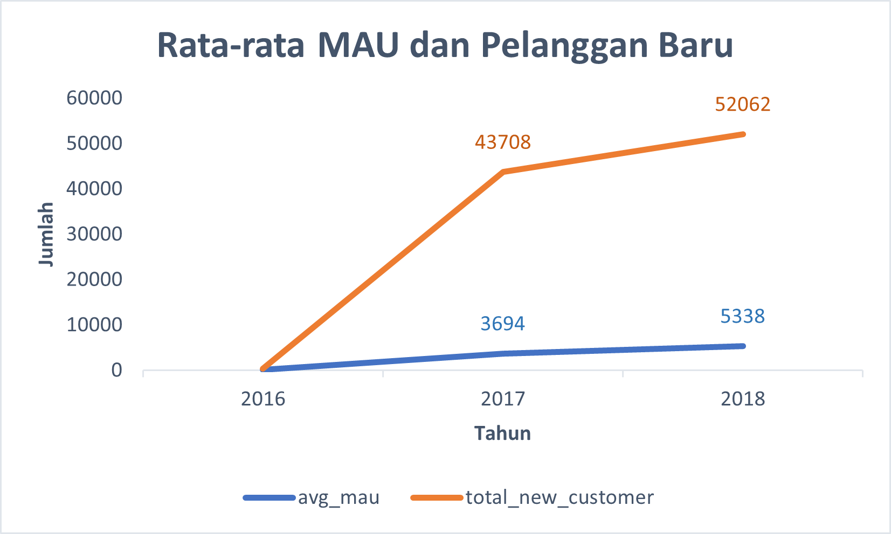
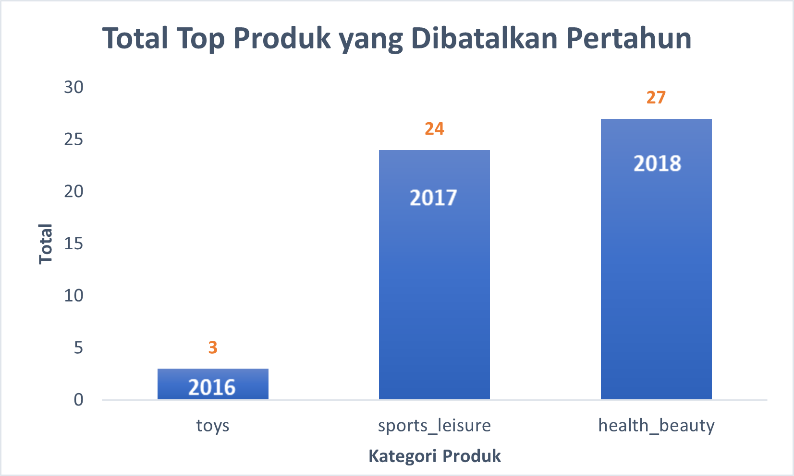
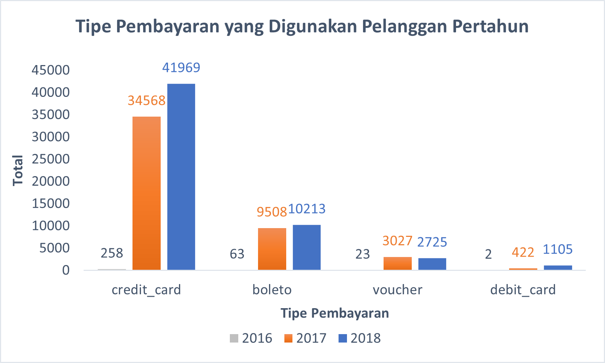

# 💰 **Comprehensive Business Intelligence Analysis of Brazilian E-Commerce Using SQL**


**Tools Used**: PostgreSQL<br>
**Visualization**: Microsoft Excel<br>
**Dataset Source**: [Olist Brazilian E-Commerce Dataset (Kaggle)](https://www.kaggle.com/datasets/olistbr/brazilian-ecommerce/data)

---

## Table of Contents

1. [Project Overview](#project-overview)
2. [Data Preparation](#data-preparation)

   - [Database Construction & ERD](#database-construction--erd)

3. [Data Analysis](#data-analysis)

   - [Customer Activity Growth](#customer-activity-growth)
   - [Product Category Performance](#product-category-performance)
   - [Payment Method Trends](#payment-method-trends)

4. [Conclusion](#conclusion)
5. [Tools & Environment](#tools--environment)
6. [Business Implications](#business-implications)
7. [Reproducibility Guide](#reproducibility-guide)
8. [Quick Access](#quick-access)

---

## 📂 **Project Overview**

### Background

Evaluating business performance is crucial for every organization, as it provides insights into the effectiveness of business strategies and operational processes. This analysis project focuses on assessing the performance of an e-commerce company based on key metrics including customer growth, product category performance, and payment trends using historical data spanning three years.

### Project Goals

This project aims to derive actionable insights through analytical and visual interpretations of the following:

1. **Customer Activity Growth per Year**
2. **Product Category Quality per Year**
3. **Payment Type Usage per Year**

---

## 📂 **Data Preparation**

The dataset originates from a Brazilian e-commerce platform, encompassing 99,441 orders between 2016 and 2018. It includes attributes such as order status, customer and seller location, item details, payment types, and customer reviews.

### Database Construction & ERD

The following steps were carried out:

1. Creating a new PostgreSQL workspace and defining table schemas using `CREATE TABLE`.
2. Importing CSV files into the respective tables.
3. Setting primary and foreign key constraints to establish table relationships.
4. Generating the Entity Relationship Diagram (ERD) using pgAdmin's ERD tool.

<details>
  <summary>Click to view SQL Queries</summary>

```sql
-- SQL CREATE TABLE statements, ALTER TABLE for primary and foreign keys
-- Followed by ERD generation instruction
```

</details>


---

## 📂 **Data Analysis**

### Customer Activity Growth

<details>
  <summary>Click to view SQL Queries</summary>

```sql
-- SQL queries for calculating MAU, new customers, repeat customers, and order frequency
-- Final combined query
```

</details>

Key findings:

- Significant increase in MAU and new customers, especially between 2016 and 2017.
- Repeat orders peaked in 2017 and slightly declined in 2018.
- Most users only placed one order per year, indicating low customer retention.




---

### Product Category Performance

<details>
  <summary>Click to view SQL Queries</summary>

```sql
-- SQL for calculating revenue, cancellations, top categories, and most canceled products
-- Includes anomaly filtering for invalid years
```

</details>

Highlights:

- Revenue increased consistently over the years.
- Leading product categories changed each year.
- `Health_beauty` was the top revenue and most canceled category in 2018, reflecting both popularity and volatility.




---

### Payment Method Trends

<details>
  <summary>Click to view SQL Queries</summary>

```sql
-- SQL queries to identify preferred payment types and their yearly usage breakdown
```

</details>

Key takeaways:

- Credit cards dominated across all years.
- Debit card usage grew significantly in 2018, likely due to promotional strategies.
- Voucher usage spiked in 2017 and declined afterward.



---

## 📂 **Conclusion**

- **Customer Growth**: The number of active and new users increased annually, though most customers did not place repeat orders. Strategies such as loyalty programs and targeted promotions could help improve retention.
- **Product Category Performance**: While revenue rose, top-performing categories varied, emphasizing the need for trend analysis. The dual nature of `health_beauty` in 2018 suggests high demand but also delivery/expectation mismatches.
- **Payment Preferences**: Credit cards remain the most preferred payment method, with emerging growth in debit cards, suggesting that payment promotions may influence consumer behavior.

---

## 📂 **Tools & Environment**

- **PostgreSQL v14** via **pgAdmin 4**
- **Microsoft Excel 2019** for plotting and visualization
- **System**: Windows 10 64-bit, 8GB RAM

---

## 📂 **Business Implications**

- Leverage strong growth in new customer acquisition by improving onboarding and engagement campaigns.
- Closely monitor top-performing categories for fulfillment issues, especially high-return items like `health_beauty`.
- Expand promotional efforts toward underutilized payment channels like debit or digital wallets to diversify options and boost conversion.

---

## 🚀 **Reproducibility Guide**

1. Clone this repository: `git clone https://github.com/yourusername/ecommerce-sql-analysis`
2. Open pgAdmin and create a new database named `ecommerce_miniproject`
3. Use the provided `CREATE TABLE` SQL scripts to set up schema
4. Import each CSV file into its corresponding table
5. Run each SQL analysis query per stage (see query blocks above)
6. Visualize the exported tables in Excel to replicate the graphs

---

## 🔗 **Quick Access**

- 📁 [SQL Scripts Folder](./sql/)
- 📊 [Analysis Charts (Excel)](./charts/)
- 📸 [Entity Relationship Diagram](./asset/gambar_1_ERD.png)
